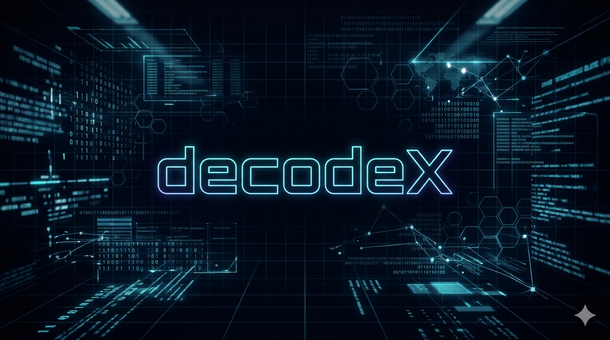
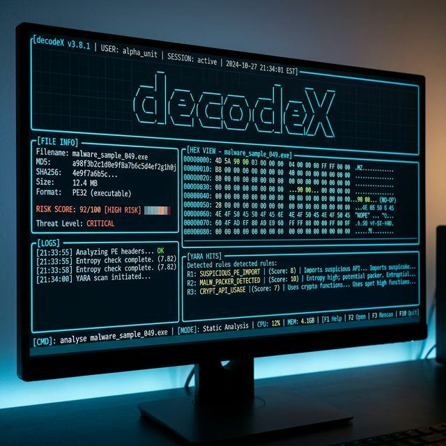
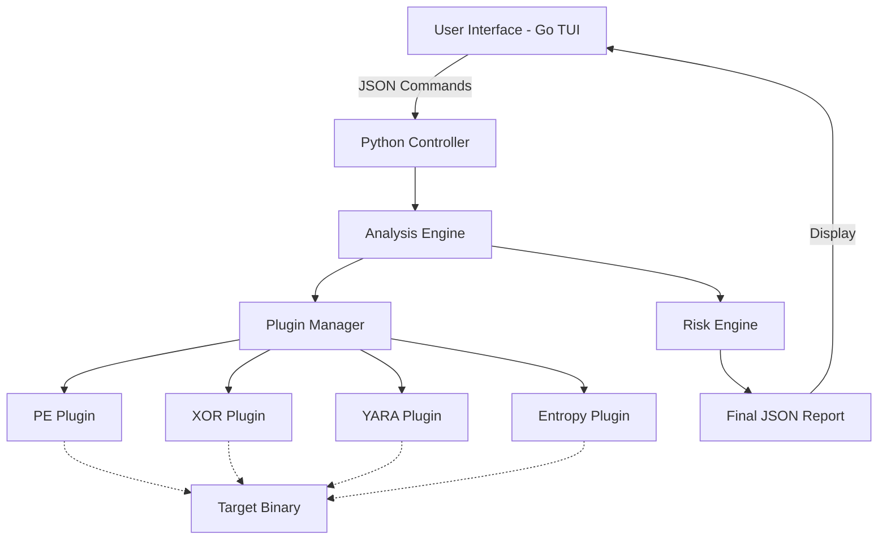

<div align="center">
  
  
  <br />

  <h1>🛡️ decodeX v3.0</h1>

  <p align="center">
    <b>Professional cybersecurity toolkit for malware triage and multi-branch decoding.</b>
    <br />
    <i>Sleek Go-based TUI | Powerful Python Analysis Engine | Industrial-Grade YARA Matching</i>
  </p>

  <p align="center">
    
    
    
    
  </p>
</div>

---

## 📖 Table of Contents
- [What is decodeX?](#-what-is-decodex)
- [Why decodeX?](#-why-decodex)
- [Features](#-features)
- [Architecture](#-architecture)
- [Installation](#-installation)
- [Quick Start](#-quick-start)
- [Roadmap](#-roadmap)
- [Contributing](#-contributing)
- [License](#-license)

---

## 🔍 What is decodeX?
**decodeX** is a professional-grade cybersecurity suite designed to bridge the gap between complex binary analysis and developer productivity. It combines a high-performance **Go-based Terminal User Interface (TUI)** with a modular **Python analysis engine** to provide a seamless, interactive experience for security researchers and SOC analysts.

## 💡 Why decodeX?
Modern malware uses multi-layered obfuscation and hidden signatures that standard tools often miss. **decodeX** stands out because:
*   **Intelligent Pathfinding**: Our "Branch & Validate" engine explores thousands of decoding paths automatically.
*   **Hybrid Power**: The safety and data-science ecosystem of Python meets the speed and UX of Go.
*   **Extensible by Design**: A true plugin-based architecture allows you to add custom analyzers in minutes.

---

## 📸 In Action
<div align="center">
  
</div>

---

## 🚀 Features

### 🖥️ Professional TUI (v2)
- **Interactive Dashboard**: Modern, navigable interface built with Go and Bubble Tea.
- **Split-Screen Analysis**: View file triage results, risk scores, and technical indicators in real-time.
- **Neon Cyberpunk Aesthetic**: High-visibility styling using Lip Gloss.

### 🔍 Advanced Malware Triage
- **Deep PE Inspection**: Powered by `pefile` for industrial-grade static analysis.
- **Imphash Support**: Calculate import hashes for malware family attribution.
- **Suspicious Indicator Detection**: Automatic detection of RWX sections, suspicious imports, and high-entropy payloads.
- **overlay Detection**: Identify hidden data appended to binaries.

### 🛠️ Core Tools
- **Auto-Decode Engine**: Multi-branch decoding with readability scoring.
- **Encoding/Decoding**: Base64, Hex, and advanced XOR (brute-force support).
- **Risk Scoring**: Heuristic-based risk engine with visual indicators.
- **YARA Signature Engine**: Industrial-grade signature matching for malware family detection.

---

## 🏗️ Architecture



---

## 📦 Installation

### 1. Simple Installation (CLI only)
```bash
pip install .
```

### 2. Full Installation (with TUI)
1. **Clone the repo**:
   ```bash
   git clone https://github.com/YOUR_USERNAME/decodeX.git
   cd decodeX
   ```
2. **Setup Python Environment**:
   ```bash
   python -m venv .venv
   source .venv/bin/activate  # On Windows: .venv\Scripts\activate
   pip install -r requirements.txt
   ```
3. **Build the TUI**:
   ```bash
   make build 
   # Or manually: go build -o decodeX tui/main.go
   ```

---

## ⚡ Quick Start

### Run the Interactive TUI
```bash
./decodeX
```

### Run a Fast CLI Analysis
```bash
decodex analyze malware.exe
```

### Decode Obfuscated Strings
```bash
decodex base64 decode "SGVsbG8gV29ybGQ="
decodex xor brute "0xDE 0xAD 0xBE 0xEF"
```

---

## 🗺️ Roadmap
- [ ] **v3.1**: Sandbox integration (Dynamic Analysis)
- [ ] **v3.2**: Exportable PDF/HTML reports
- [ ] **v3.5**: Network capture (PCAP) analyzer plugin
- [ ] **v4.0**: Machine Learning-based malware classification

---

## 🤝 Contributing
Contributions are welcome! Please see [CONTRIBUTING.md](CONTRIBUTING.md) for details on our code of conduct and the process for submitting pull requests.

## 📄 License
This project is licensed under the MIT License - see the [LICENSE](LICENSE) file for details.

---
<p align="center">
  Developed by <b>Achraaf</b> | Enhanced by <b>Antigravity AI</b>
</p>